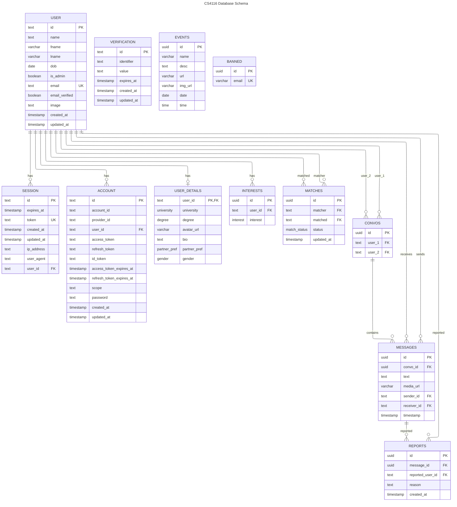

# Database Schema Diagram

```mermaid
---
title: CS4116 Database Schema
config:
    layout: elk
---
erDiagram
    USER {
        text id PK
        text name
        varchar fname
        varchar lname
        date dob
        boolean is_admin
        text email UK
        boolean email_verified
        text image
        timestamp created_at
        timestamp updated_at
    }

    SESSION {
        text id PK
        timestamp expires_at
        text token UK
        timestamp created_at
        timestamp updated_at
        text ip_address
        text user_agent
        text user_id FK
    }

    ACCOUNT {
        text id PK
        text account_id
        text provider_id
        text user_id FK
        text access_token
        text refresh_token
        text id_token
        timestamp access_token_expires_at
        timestamp refresh_token_expires_at
        text scope
        text password
        timestamp created_at
        timestamp updated_at
    }

    VERIFICATION {
        text id PK
        text identifier
        text value
        timestamp expires_at
        timestamp created_at
        timestamp updated_at
    }

    USER_DETAILS {
        text user_id PK, FK
        university university
        degree degree
        varchar avatar_url
        text bio
        partner_pref partner_pref
        gender gender
    }

    INTERESTS {
        uuid id PK
        text user_id FK
        interest interest
    }

    MATCHES {
        uuid id PK
        text matcher FK
        text matched FK
        match_status status
        timestamp updated_at
    }

    EVENTS {
        uuid id PK
        varchar name
        text desc
        varchar url
        varchar img_url
        date date
        time time
    }

    CONVOS {
        uuid id PK
        text user_1 FK
        text user_2 FK
    }

    MESSAGES {
        uuid id PK
        uuid convo_id FK
        text text
        varchar media_url
        text sender_id FK
        text receiver_id FK
        timestamp timestamp
    }

    BANNED {
        uuid id PK
        varchar email UK
    }

    REPORTS {
        uuid id PK
        uuid message_id FK
        text reported_user_id FK
        text reason
        timestamp created_at
    }

    USER ||--o{ SESSION : "has"
    USER ||--o{ ACCOUNT : "has"
    USER ||--o| USER_DETAILS : "has"
    USER ||--o{ INTERESTS : "has"
    USER ||--o{ MATCHES : "matcher"
    USER ||--o{ MATCHES : "matched"
    USER ||--o{ CONVOS : "user_1"
    USER ||--o{ CONVOS : "user_2"
    USER ||--o{ MESSAGES : "sends"
    USER ||--o{ MESSAGES : "receives"
    USER ||--o{ REPORTS : "reported"
    CONVOS ||--o{ MESSAGES : "contains"
    MESSAGES ||--o{ REPORTS : "reported"
```
